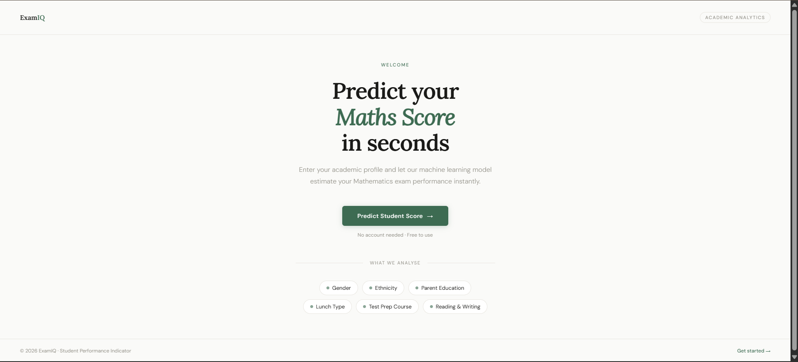
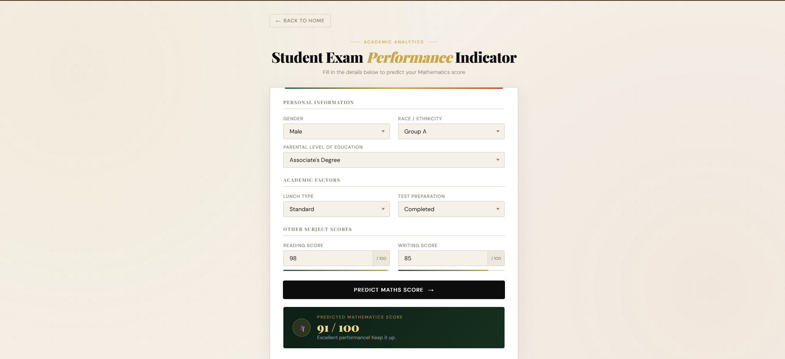

# Student Performance Prediction System

A machine learning web app that predicts student performance based on study hours, prior scores, and contextual factors.

## Tech stack

| Layer | Technology | Purpose |
|---|---|---|
| Language | Python 3.x | Core runtime |
| Web framework | Flask | HTTP server and routing |
| ML | Scikit-learn | Model training and evaluation |
| Data | Pandas · NumPy | Data wrangling and numerics |
| Serialization | Dill | Model and pipeline persistence |
| Production server | Gunicorn | WSGI deployment |

## Project structure
## Project structure
```
mlproject/
├── artifacts/          # Saved models and preprocessors
├── notebook/           # Jupyter notebooks for EDA
├── src/
│   ├── pipeline/       # Training and prediction pipelines
│   └── utils.py        # Shared utilities
├── templates/
│   ├── index.html      # Landing page
│   └── home.html       # Prediction form
├── images/             # Screenshots
│   ├── home.png
│   └── prediction.png
├── app.py              # Flask application entry point
├── requirements.txt    # Dependencies
├── setup.py            # Package setup
└── README.md           # Project documentation
```

## Getting started
```bash
pip install -r requirements.txt   # install dependencies
python app.py                     # run dev server
gunicorn app:app                  # production
```
## 📸 Screenshots

### 🏠 Home Page


### 📊 Prediction Page

